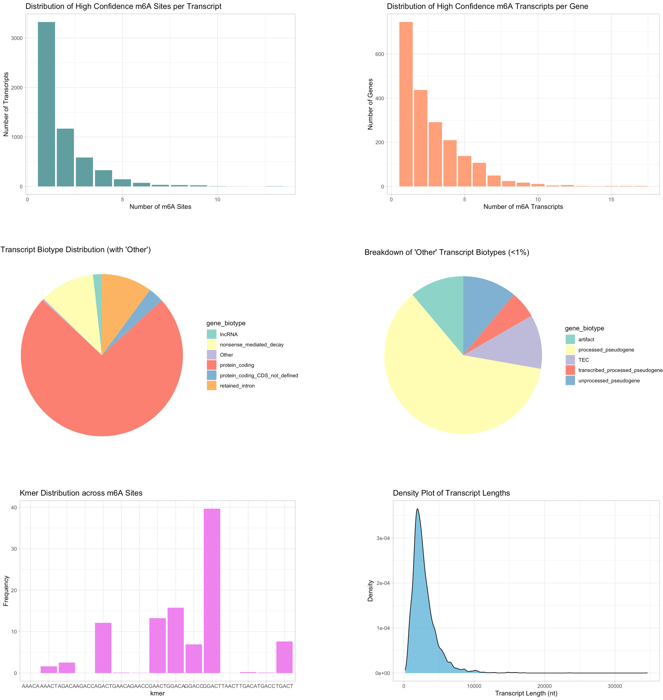
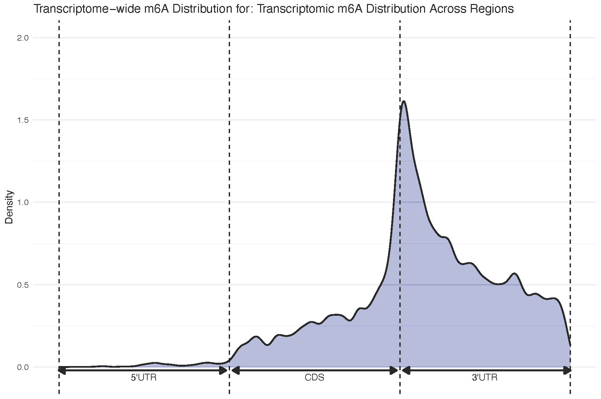
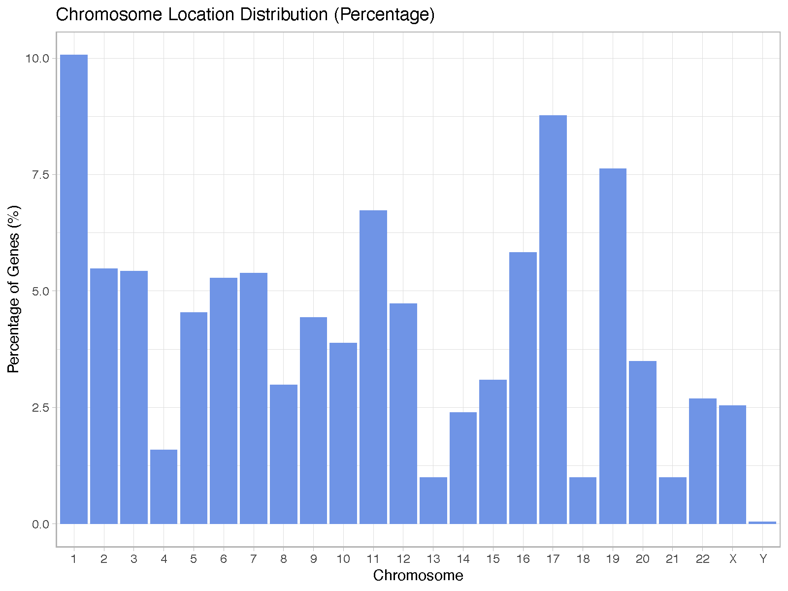
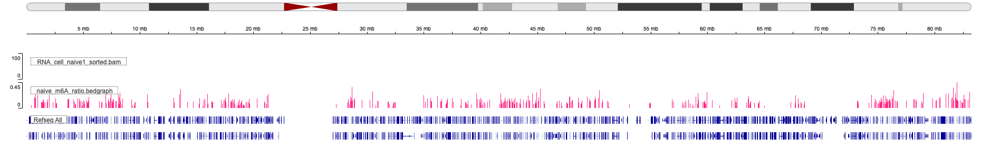

```{r, include = FALSE}
knitr::opts_chunk$set(
  echo = TRUE,       # show R code
  message = FALSE,   # suppress messages
  warning = FALSE,   # suppress warnings
  progress = FALSE   # hide knit progress lines
)
```

# Introduction
`m6AnetAnalyzer` is an R package designed to streamline the post-processing and interpretation of site-level m6A predictions from m6Anet. It provides descriptive summaries of m6A distribution across transcripts, genes, biotypes, and transcript regions, and enables condition comparisons through a calculated weighted modification ratio. By integrating differential gene expression data, the package links methylation changes with expression differences, providing biotype-specific and region-specific insights into how m6A localization patterns relate to transcriptional regulation.

# Installation
`m6AnetAnalyzer` can be installed on **Windows, macOS, and Linux**. It requires R (≥4.0).

```{r installation, eval=FALSE}
# Install devtools if needed
install.packages("devtools")

# Install Bioconductor dependencies
if (!requireNamespace("BiocManager", quietly = TRUE))
    install.packages("BiocManager")

BiocManager::install(c(
    "AnnotationDbi",
    "org.Hs.eg.db",
    "GenomicFeatures",
    "GenomicRanges",
    "IRanges",
    "S4Vectors",
    "txdbmaker"
))

# Install CRAN dependencies
install.packages(c("dplyr", "ggplot2", "tidyr", "magrittr", "kableExtra"))

# Install m6AnetAnalyzer from GitHub
devtools::install_github("hannalee809/m6AnetAnalyzer", build_vignettes = TRUE)
```

# Input Data

**Input size considerations:** m6AnetAnalyzer does not impose hard-coded limits on input file size. Performance is primarily constrained by available system memory and the number of m6A sites analyzed. For large datasets, we recommend processing data on systems with sufficient memory.

The first step in using **m6AnetAnalyzer** is importing the `data.site_proba.csv` file, which represents the final output from **m6Anet**. The columns include:

1. **m6A site information**

    - `ensembl_transcript_id`: Ensembl transcript identifier
    - `ensembl_gene_id`: Ensembl gene identifier
    - `otthumg_gene_id` / `otthumg_transcript_id`: Optional human gene/transcript IDs for cross-referencing
    - `ensembl_transcript_name` / `ensembl_gene_name`: Human-readable transcript and gene names
    - `transcript_length`: Length of the transcript in nucleotides
    - `gene_biotype`: Biotype of the transcript (e.g., protein_coding, lncRNA)
    - `transcript_position`: Position of the m6A site within the transcript

2. **Read coverage**

    - `n_reads`: Number of reads covering the m6A site

3. **Modification information**

    - `probability_modified`: Predicted probability of modification at the site (0–1)
    - `kmer`: Sequence k-mer context surrounding the modified nucleotide
    - `mod_ratio`: Observed modification ratio (0–1), reflecting the proportion of reads supporting the modification

> **Note:** Some columns in the raw file contain multiple values combined with a `|` separator. These must be split before using the data with this package.

For this tutorial, we provide two example datasets:

1. 100 predicted m6A sites from the **Gli36** glioma cell line.  
2. 100 predicted m6A sites from the same cell line following **IGF2BP2 siRNA knockdown**.

These example datasets allow you to explore the package workflow without needing your own experimental data.

```{r import-data, echo=FALSE}
library(kableExtra)
library(m6AnetAnalyzer)
```

```{r example-data-load}
# Load the example dataset included in the package
data("example_m6A_naive_gli36_cells")
head(example_m6A_naive_gli36_cells)
```

# Descriptive Statistics

## Summary Report of m6Anet Output

After importing the `data.site_proba.csv` file in the required format, you can generate a summary report using the `summarize_m6anet_output()` function. This function produces an HTML report that includes the following:

1. **Overview table:** Total number of detected m6A sites, transcripts, and genes, as well as the number of sites, transcripts, and genes with a **modification probability > 90%**. These high-confidence sites are filtered and used for the rest of the report, and they should also be used for downstream analyses.
2. **High-confidence sites per transcript:** Table and histogram showing the distribution of the number of high-confidence sites per transcript.
3. **High-confidence transcripts per gene:** Table and histogram showing the distribution of high-confidence transcripts per gene.
4. **Transcript biotype distribution:** Table and pie chart(s) showing counts and frequencies of high-confidence transcripts by biotype.
5. **Modified k-mer distribution:** Table and bar graph showing counts and frequencies of modified k-mers.
6. **Transcript length distribution:** Table and density graph showing the lengths of modified transcripts, grouped into bins: 101–500 bp, 501–1000 bp, 1001–5000 bp, 5001–10000 bp, and >10000 bp.

```{r summarize-m6anet-output, eval=FALSE}
# Generate the summary HTML report
summarize_m6anet_output(
  example_m6A_naive_gli36_cells, 
  output_file = "naive_summary_report.html"
)
```

```{r summary-plot, echo=FALSE, out.width="100%", out.height="800px"}

```

## Filter m6A Sites
m6Anet recommends retaining sites with probability_modified > 0.9.
This function applies a user-defined threshold (default = 0.9) and returns the filtered dataset.

> **Important:** Use this filtered dataset from this point onward for downstream analyses.

```{r filter-m6a, eval = FALSE}
filtered_m6A_naive_gli36_cells <- filter_m6a_sites(example_m6A_naive_gli36_cells,
                                       prob_modified =0.9)
```

## Transcript Region Analysis
These functions allow you to:

1. **Assign each m6A site to a transcript region**  
   (5'UTR, CDS, or 3'UTR)

2. **Compute its relative position within that region**, scaled 0–1.
This

3. **Visualize the global distribution of m6A** across these regions using a kernel density plot.

This workflow requires a GTF annotation file.

```{r tx-regions, eval = FALSE}
# Path to GTF annotation file
gtf_path <- "/path/to/gencode.v45.annotation.gtf"

# Step 1: Extract transcript region lengths (5'UTR, CDS, 3'UTR)
tx_df <- get_transcript_region_lengths(gtf_path)

# Step 2: Annotate each m6A site with its region and relative position
filtered_m6A_naive_gli36_cells <-
  map_relative_tx_regions_to_m6A(
    filtered_m6A_naive_gli36_cells,
    tx_df
  )

# Step 3: Visualize distribution of m6A across transcript regions
p <- plot_relative_positions(filtered_m6A_naive_gli36_cells, label = "naive") # add plot label if desired
```

The output includes the original m6A site information along with transcript-region annotations (5′UTR, CDS, 3′UTR). For each region, the table reports its length, start and end positions, the region in which the site falls, and the site’s relative position within that region. Some sites may not map to any transcript region (i.e., sites on non-coding transcripts with no annotated UTR/CDS structures). These sites are retained in the output, with `NA` values for the transcript-region fields.

```{r tx-region-table, echo=FALSE}
knitr::kable(
data.frame(
m6a_site_info... = c("..."),
utr5_length = "159",
utr3_length = "1457",
cds_length_tx = "834",
start_utr5 = "1",
end_utr5 = "159",
start_cds = "160",
end_cds = "992",
start_utr3 = "993",
end_utr3 = "2449",
isin_5utr = "0",
isin_cds = "0",
isin_3utr = "1",
rel_5utr = "NA",
rel_cds = "NA",
rel_3utr = "0.78"
),
align="l"
) %>% 
  kable_styling(
    font_size = 10,
    full_width = FALSE
  )
```

```{r tx-plot, echo=FALSE, out.width="80%", out.height="400px"}

```

## Chromosomal Annotation
This function assigns each m6A site to its chromosome using human gene annotations from org.Hs.eg.db. Provide the m6A dataframe and optionally specify whether the results should be saved as a CSV and whether a chromosomal distribution plot should be generated.

```{r chr-dist, eval=FALSE}
calculate_chromosome_location(filtered_m6A_naive_gli36_cells,
                              output_csv=NULL, 
                              output_plot="naive_chr_distribution.png")
```

```{r chr-plot, echo=FALSE, out.width="80%", out.height="400px"}

```

## Weighted Modification Ratio
This metric summarizes transcript-level methylation by combining the number of modified sites, their modification ratios, and transcript length. You can either input the m6a dataframe or the annotated output from map_relative_tx_regions_to_m6A(), as this will provide a regional summary in addition to the weighted modificaition ratio calculation.

The **weighted modification ratio** per transcript is defined as:

$$
\text{Weighted Modification Ratio} = \frac{\sum_{i=1}^{n} r_i}{L}
$$

where:  

- \(r_i\) = modification ratio at site \(i\)  
- \(n\) = number of m6A sites in the transcript  
- \(L\) = length of the transcript (in nucleotides)

The function returns a dataframe containing one row per transcript with:

- total modification ratio across all sites
- counts of sites in 5′UTR, CDS, and 3′UTR (if `tx_info` = TRUE)
- the computed weighted modification ratio

```{r calc-wmr, eval=FALSE}
calculate_weighted_mod_ratio(filtered_m6A_naive_gli36_cells, mod_ratio_column = "mod_ratio")
```

```{r wmr-table, echo=FALSE}
library(kableExtra)

knitr::kable(
  data.frame(
    m6a_transcript_info... = c("...", "..."),
    sum_mod = c("1.81", "1.79"),
    n_sites = c("3", "3"),
    sites_in_5utr = c("0", "0"),
    sites_in_cds = c("0", "0"),
    sites_in_3utr = c("3", "3"),
    weighted_mod_ratio = c("0.00075", "0.00067")
  ),
  align = "l"
) %>%
  kable_styling(
    font_size = 11,
    full_width = FALSE
  )
```

# Incorporating External Annotations
This part of the package provides tools to convert m6Anet transcript-based coordinates into genomic coordinates using GTF annotations. The resulting genomic positions can be exported as a BED file, enabling direct visualization of m6A sites in genome browsers such as IGV or UCSC Genome Browser. In addition, a secondary function allows users to annotate their m6A BED file with any user-provided BED datasets, making it easy to integrate external features such as RBP peaks, miRNA binding sites, SNPs, or other genomic intervals.

## Convert to Genomic Coordinates and Create BED Files
m6Anet reports modification sites using transcript-based positions, which cannot be directly viewed in genome browsers. To enable genomic visualization and downstream annotation, the package includes a function that:

- maps transcript positions to genomic coordinates using a user-provided GTF annotation
- generates standard BED6 and BedGraph tables
- optionally writes these to files for IGV/UCSC Genome Browser

This enables seamless integration of m6A site calls with external genomic features such as RBP binding sites, miRNA binding sites, SNPs, or any other interval-based annotation.

Inputs:

- **data.site_proba_df:** m6Anet output; must include ensembl_transcript_id, transcript_position, ensembl_gene_name, mod_ratio.
- **gtf_path:** path to a GENCODE/Ensembl GTF (or GFF3) annotation.
- **output_bed:**  optional path to write the BED6 file.
- **output_bedgraph:** optional path to write the BedGraph file.

```{r bed-file, eval=FALSE}
create_bed_file(
  filtered_m6A_naive_gli36_cells,
  gtf_path,
  output_bed = "path/to/ouput/bed",
  output_bedgraph = "path/to/output/bedgraph"
)
```

Outputs:

1. m6a_df_with_genomic_coordinates

    - transcript-level positions mapped to chr, genomic_pos, and strand.
    - the `name` column is automatically constructed as transcriptID_position (e.g., ENST00000335137_1285).
    - `score`: mod_ratio * 1000  (for IGV visualization of m6A levels)

2. bed_df: ready-to-visualize BED6 data frame.
3. BED6 and BEDGRAPH files saved to user-provided path.


```{r bed-format, echo=FALSE}
knitr::kable(
data.frame(
chr = c("chr1", "chr1", "chr2"),
start = c(10048291, 10599321, 20488511),
end = c(10048292, 10599322, 20488512),
name = c("ENST00000335137_1285",
"ENST00000284987_452",
"ENST00000491231_97"),
score = c(820, 640, 995),
strand = c("+", "-", "+")
),
caption = "Example BED6 output generated by create_bed_file()"
)
```

This figure shows an example of m6A visualization in IGV using the generated bedGraph file. m6A levels are represented by the score track. The view is zoomed into chromosome 17, where the pink signal reflects m6A levels and the blue track shows the gene annotation.
 
```{r igv-plot, echo=FALSE, out.width="100%", out.height="200px"}

```

## Annotate m6A with External Genomic Features

This section demonstrates how to annotate m6A sites using user-provided genomic feature files (e.g., RBP binding sites, miRNA targets, SNPs, enhancers, promoters). The annotate_m6A_overlaps() function accepts any BED-like table as long as genomic coordinates and a feature column are supplied.

The function takes two inputs:

1. **m6A bed table** with chromosome, start, end, and strand (from `create_bed_file()`)
2. **Annotation table** with genomic intervals (chr, start, end, strand) and a feature label (e.g., RBP_name, SNP_ID, miRNA_ID)

> **Note:** Both inputs should use the same coordinate system — either 0-based or 1-based. By default, the function assumes 0-based coordinates (`zero_based` = TRUE). If your input tables use 1-based coordinates, set `zero_based` = FALSE.

Both inputs are internally converted to `GenomicRanges` objects. If `zero_based = TRUE`, the coordinates are automatically converted from 0-based to 1-based as required by `GenomicRanges`. Overlaps are computed using `findOverlaps()`, and all annotation metadata columns are retained. Strand matching can be required or ignored depending on the use case.

The function returns two data frames:

1. **overlap_df** containing row-level overlaps

    - `m6A_index`: index of the m6A site, corresponds with the row ID in the original m6A dataframe
    - Feature name (from `feature_col`)
    - All additional annotation metadata columns 

2. **annotated_m6A_df**

    - Original m6A site information
    - Overlapping_Features: semicolon-separated list of feature names
    - Feature_Count: number of unique overlapping features
    
```{r annotate-m6A-example, message=FALSE, warning=FALSE}
# Step 1: Load example BED file for Naive Gli36
data("example_m6A_naive_gli36_BED")
```

```{r show-naive-bed, echo=FALSE}
knitr::kable(head(example_m6A_naive_gli36_BED), 
             caption = "First 6 rows of example m6A BED file")
```

```{r load-example-rbp}
# Step 2: Load example RBP annotation
data("example_rbp_annotation")

# Define columns
colnames(example_rbp_annotation) <- c(
"chr", "start", "end", "peak_id", "strand",
"RBP_name", "experiment_method", "sample",
"accession_of_raw_data", "conf_score"
)
```

```{r show-rbp-bed, echo=FALSE}
knitr::kable(head(example_rbp_annotation),
caption = "First 6 rows of example RBP annotation") %>%
  kableExtra::kable_styling(font_size = 11)
```

```{r run-annotation,message=FALSE, warning=FALSE}
# Step 3: Run annotation function
annotated_example_naive_with_rbp <- annotate_m6a(
example_m6A_naive_gli36_BED,
example_rbp_annotation,
feature_col = "RBP_name"
)
```

Here are the outputs of the function:
```{r annotation-output01, echo=FALSE}
knitr::kable(head(annotated_example_naive_with_rbp$overlap_df),
caption = "First 6 rows of overlap between m6A sites and RBP annotations") %>%
  kableExtra::kable_styling(font_size = 11)
```

```{r annotation-output02, echo=FALSE}
knitr::kable(head(annotated_example_naive_with_rbp$annotated_m6A_df),
caption = "First 6 rows of summarized annotated m6A sites") %>%
  kableExtra::kable_styling(font_size = 11)
```

Both output dataframes include a reference to the original m6A sites. In `overlap_df`, the first column `m6a_index` directly corresponds to the m6A site identifier from the input BED file, providing a one-to-one mapping for each overlap with RBPs. In `annotated_m6A_df`, the first column is a `row_id` that references the row of the original m6A dataframe. This allows users to easily merge the summarized annotation back with their original m6A dataset for downstream analyses. Essentially, `overlap_df` gives a detailed, long-format view of individual overlaps, while `annotated_m6A_df` provides a compact summary with a direct link to the original m6A sites.

## Usage of built-in example external annotations

We provide pre-processed example datasets in the `extdata/` folder to allow users to explore the annotation functions without needing large external files. These include:

- Human dbSNP subset: a small set of SNPs mapped to transcripts, including position, gene, and functional annotation.
- Human RBP subset: a curated subset of RNA-binding protein binding sites with genomic coordinates and experimental metadata.

These subsets are intended for demonstration purposes and can be loaded with system.file() for use in example workflows. For instance:

```{r load-annotation-file }
# File paths
rbp_file <- system.file("extdata", "RBP_POSTAR_human_subset.bed", package = "m6AnetAnalyzer")
snp_file <- system.file("extdata", "dbSNP_human_subset.bed", package = "m6AnetAnalyzer")

# Load data
rbp_df <- readr::read_tsv(rbp_file, col_names = F)
snp_df <- readr::read_tsv(snp_file, col_names = F)

# set columns
colnames(rbp_df) <- c(
  "chr",                   # Chromosome of the RBP binding site
  "start",                 # Start position (0-based)
  "end",                   # End position
  "peak_id",               # Unique identifier for the peak
  "strand",                # Strand of the peak (+ or -)
  "RBP_name",              # Name of the RNA-binding protein
  "experiment_method",     # Method used to detect the peak (e.g., CLIP-seq, PIP-seq)
  "sample",                # Sample or condition in which the peak was observed
  "accession_of_raw_data", # Accession number for the raw experiment data
  "conf_score"             # Confidence score or enrichment measure for the peak
)

colnames(snp_df) <- c(
  "chr",                  # Chromosome of the SNP
  "start",                # Start position (0-based)
  "end",                  # End position (1-based; SNP occupies 1 bp)
  "snp_id",               # Unique SNP identifier
  "variation",            # Allele variation (e.g., A>G)
  "strand",               # Strand information (usually "*" for SNPs)
  "clinical_significance",# Clinical annotation of the SNP (e.g., benign, pathogenic)
  "function_class",       # Functional classification (e.g., exonic, intronic)
  "gene"                  # Associated gene symbol or ID
)

head(rbp_df)
head(snp_df)
```

Users can then run `annotate_m6a()` using these small datasets to quickly explore the workflow before applying the pipeline to their own full-size datasets.

# Comparative Analysis

Because m6Anet outputs predictions for individual samples, this package adds tools for comparing m6A patterns across conditions. The main capabilities include:

1. Shared vs. condition-specific features: Summaries of common and unique m6A sites, transcripts, and genes between groups.
2. Differential methylation analysis

    - No replicates: computes a weighted modification ratio for each transcript and compares conditions using a log2 fold-change to highlight transcripts with clear shifts in methylation.
    - With replicates: runs a Wilcoxon rank-sum test on weighted modification ratios to identify transcripts showing statistically significant hypermethylation in one condition.

3. Integration with differential gene expression: Results can be merged with DE analyses for joint interpretation.
4. Functional categorization: Transcripts are grouped into six classes reflecting combined methylation and expression behavior (e.g., hypermethylated + upregulated, hypermethylated + unchanged). For each class, the package reports transcript biotypes and m6A site distributions across transcript regions, providing structured biological context.

## Compare m6A Distributions

Understanding how m6A sites, transcripts, or genes differ between samples is often the first step in comparative methylation analysis. The compare_m6a_distribution() function provides a simple way to quantify shared and unique features across two or more groups.

This function takes a **named list**, where each element contains a vector of m6A site IDs, transcript IDs, or gene IDs for each condition. It returns a structured summary of overlaps and differences, including:

- Unique elements per group
- Pairwise intersections: shared elements between every pair of groups
- Common elements across all groups
- For exactly 3 groups, the function also reports elements that are shared by two groups but absent from the third.

```{r compare-m6a}
# Comparing the m6A distribution between IGF2BP2 KD and Naive

# Load IGF2BP2 data
data("example_m6A_igf_gli36_cells")

# Create m6A site list
example_m6A_igf_gli36_cells$site <- paste(example_m6A_igf_gli36_cells$ensembl_transcript_id, example_m6A_igf_gli36_cells$transcript_position, sep = "_") # creates a unique site identifier

example_m6A_naive_gli36_cells$site <-  paste(example_m6A_naive_gli36_cells$ensembl_transcript_id, example_m6A_naive_gli36_cells$transcript_position, sep = "_")

site_list <- list(igf = unique(example_m6A_igf_gli36_cells$site),
                  naive = unique(example_m6A_naive_gli36_cells$site))

# Create m6A transcript list
tx_list <- list(igf = unique(example_m6A_igf_gli36_cells$ensembl_transcript_name),
                  naive = unique(example_m6A_naive_gli36_cells$ensembl_transcript_name))

# Create m6A gene list
gene_list <- list(igf = unique(example_m6A_igf_gli36_cells$ensembl_gene_name),
                  naive = unique(example_m6A_naive_gli36_cells$ensembl_gene_name))

# Run function
#common_unique_sites <- compare_m6a_distribution(site_list)
#common_unique_tx <- compare_m6a_distribution(tx_list)
common_unique_genes <- compare_m6a_distribution(gene_list)

# Distribution values
attr(common_unique_genes, "summary")

# Show common genes
common_unique_genes$common_all
```

## Differential Methylation

### No Replicates

Using the weighted modification ratios produced by calculate_weighted_mod_ratio(), this function merges two transcript-level data frames, keeps only transcripts present in both groups, and computes the log2 fold change in weighted modification ratio. Although observational, this metric highlights transcripts that appear hypermethylated in one condition relative to the other. This is especially useful when integrating methylation changes with gene expression to identify regulatory patterns across conditions.

The inputs of this function are the dataframes for Group 1 and Group 2 that contain the `weighted_mod_ratio` column. 

> **Note:** If you plan to run **Differential Methylation and Gene Expression**, make sure to run `map_relative_tx_regions_to_m6a()` before `calculate_weighted_mod_ratio()`. This ensures transcript-region annotations are included in the downstream dataframes.

This function returns a merged dataframe containing:

- Core m6A transcript data (transcript ID, gene ID, length, biotype)
- Weighted modification ratios (WMR) for each condition
- The log2 fold change of the WMR, using condition 1 as the numerator.

    - Positive values indicate higher methylation in condition 1
    - Negative values indicate higher methylation in condition 2

```{r wmr}
# Load example dataframes with the weighted modification ratio calculations
data("naive_gli36_cells_wmr")
data("igf_gli36_cells_wmr")

# Show first few lines
head(naive_gli36_cells_wmr)

# Run function
logfc_wmr_igf_vs_naive <- log2fc_weighted_mod_ratio(group1_df = igf_gli36_cells_wmr, # IGF set as condition 1
                                                    group2_df = naive_gli36_cells_wmr, # Naive set as condition 2
                                                    group1_name = "NAIVE",
                                                    group2_name = "IGF")

head(logfc_wmr_igf_vs_naive)
```

From the first few lines of the output, we notice that these specific transcripts are positive and therefore hypermethylated in the IGF2BP2 KD condition compared to the Naive.

### With Replicates
If your study includes replicates, this function performs a Wilcoxon rank-sum test to assess whether a transcript shows higher or lower methylation between two conditions. Use the raw, unfiltered m6A site-level data so that all potential modification sites are represented. This ensures accurate aggregation and avoids bias introduced by pre-filtering.

This function will undergo the following key steps:

1. Combining replicates for each condition
2. Filtering out transcripts with zero WMR across all replicates
3. Calculating per-transcript median WMR for each condition
4. Running a Wilcoxon rank-sum test between conditions
5. Returning transcript metadata and differential statistics

You must provide two lists:

- `condition1_list`: list of data frames for condition 1
- `condition2_list`: list of data frames for condition 2

Each data frame must include these columns:

- `ensembl_transcript_name`
- `ensembl_transcript_id`
- `ensembl_gene_id`
- `ensembl_gene_name`
- `gene_biotype`
- `transcript_length`
- `weighted_mod_ratio`

```{r run_differential_test, eval=F}
# Define lists
naive_list <- list(naive1_wmr, naive2_wmr, naive3_wmr)
igf_list <- list(igf1_wmr, igf2_wmr, igf3_wmr)

# Function call
results <- run_wmr_differential_test(
condition1_list = naive_list,
condition2_list = igf_list,
condition1_name = "naive",
condition2_name = "IGF"
)
```

The output of this function is a data frame containing one row per transcript with

- Transcript metadata
- `median_wmr_condition1`
- `median_wmr_condition2`
- `median_diff` (condition2 − condition1). A positive `median_diff` means higher median WMR in the second condition.
- `p_value` from Wilcoxon test. Low `p_value` indicates statistical significance.

```{r wilcox_output, echo=FALSE}
knitr::kable(
data.frame(
ensembl_transcript_name = c("JKAMP-213", "PHPT1-204"),
ensembl_transcript_id = c("ENST00000602482.5", "ENST00000463215.1"),
ensembl_gene_id = c("ENSG00000050130.18", "ENSG00000054148.18"),
ensembl_gene_name = c("JKAMP", "PHPT1"),
gene_biotype = c("retained_intron", "protein_coding_CDS_not_defined"),
transcript_length = c("2302", "627"),
median_wmr_condition1 = c("0.0011716045", "0.0001362911"),
median_wmr_condition2 = c("0", "0"),
median_diff = c("-1.171604e-03", "-1.362911e-04"),
p_value = c("0.0765225", "0.0765225")),
align="l", 
caption = "Example output from run_wmr_differential_test()"
) %>% 
  kable_styling(
    font_size = 10,
    full_width = FALSE
  )
```

## Methylation and Gene Expression

After performing differential methylation analysis, it is often informative to integrate these results with **differential gene expression (DGE)** results (e.g., from DESeq2) to see how methylation changes relate to gene-level expression changes. The function `weighted_mod_ratio_and_DGE_NEW()` facilitates this integration and visualization.

This function can handle **two types of WMR inputs**:

1. Output from `log2fc_weighted_mod_ratio()` (no replicates)
2. Output from `run_wmr_differential_test()` (with replicates)

### No Replicates

- Use the output from `log2fc_weighted_mod_ratio()`, which contains the column `log2fc_weighted_mod_ratio`.
- Provide the DESeq2 results as a separate data frame. This should include:

    - Gene ID column
    - Log2 fold change column
    - Adjusted p-value column

**Important:** Both `log2fc_weighted_mod_ratio()` and DESeq2 treat **group 2 as experimental** and **group 1 as control**, so ensure these match when integrating results.

- Set `input_type = "log2fc_wmr"` to indicate this type of input.
- Specify the gene ID column names for both the WMR and DESeq2 data frames so the function can merge them correctly.
- Specify the log2FC and p-value column names in your DESeq2 results.

```{r wmr-dge-no-replicates}
# View output of log2fc weighted mod ratio
head(logfc_wmr_igf_vs_naive)

# Load DESeq output
data("igf_vs_naive_DGE_filt")
head(igf_vs_naive_DGE_filt)

# Run function
log2wmr_dge_igf_naive_results <-
  weighted_mod_ratio_and_DGE(
    wmr_df = logfc_wmr_igf_vs_naive,
    deseq = igf_vs_naive_DGE_filt,
    input_type = "log2fc_wmr",
    deseq_gene_col = "ensembl_gene_id_version",
    log2fc_col = "igf_vs_naive_log2FC",
    padj_col = "pvalue_igf_vs_naive",
    group1_name = "NAIVE", # Control group
    group2_name = "IGF" # Experimental group
  )

# Show plot
log2wmr_dge_igf_naive_results$plot

# Show merged dataframes
head(log2wmr_dge_igf_naive_results$data)
```

From this output, we can see that these transcripts are more methylated in the Naive (Gli36) condition compared to IGF2BP2 KD. However, only one gene is significantly differentially expressed, and it is upregulated in the IGF2BP2 KD condition, suggesting that methylation changes do not necessarily correspond directly to expression changes for most genes.

### With Replicates
If your study includes replicates, use the output from run_wmr_differential_test() as the WMR input. Provide the DESeq2 results as a separate data frame, and set input_type = "wmr_diff" to indicate that the input contains median differences from the WMR analysis.

Inputs:

- wmr_df: output from run_wmr_differential_test()
- deseq: DESeq2 results with gene IDs, log2 fold changes, and adjusted p-values
- Optional WMR significance thresholds (wmr_sig), including:

    - p_val: p-value cutoff for WMR significance
    - diff: minimum median difference threshold

Outputs:

- data: merged data frame with median WMR differences and DGE statistics
- plot: scatter plot with:

    - X-axis: median difference in weighted modification ratio
    - Y-axis: gene log2 fold change

Points are colored by significance:

- Purple: significant in both WMR and DGE
- Red: DGE only
- Green: WMR only
- Black: not significant

This allows you to visualize how changes in methylation correspond to gene expression, highlighting transcripts with significant differences in either or both measures.

```{r wmr-dge-with-replicates, eval=FALSE}
diff_test_dge <-
  weighted_mod_ratio_and_DGE(
    # results from differential test
    wmr_df = diff_test_igf_naive_filt,
    deseq = igf_vs_naive_DGE,
    # set to wmr_diff
    input_type = "wmr_diff",
    # set cut off for significance if wanted
    wmr_sig = list(diff = 0.002),
    deseq_gene_col = "ensembl_gene_id_version",
    log2fc_col = "igf_vs_naive_log2FC",
    padj_col = "pvalue_igf_vs_naive",
    group1_name = "NAIVE",
    group2_name = "IGF"
  )
```

```{r wmr-dge-plot, echo=FALSE, out.width="100%", out.height="400px", fig.cap="Differential expression plot"}
knitr::include_graphics("diff_test_dge_plot.pdf")
```

## Summarize Methylation and Expression

After integrating these results with differential gene expression (DGE) statistics (e.g., DESeq2), you may want to organize transcripts into biological categories and summarize properties of each cluster.

### No Replicates

**Input Requirements**

The input data frame must include the merged output from the `weighted_mod_ratio_and_DGE(input_type = "log2fc_wmr")` with the m6A transcript information, the regional summaries, the log2fc_weighted_mod_ratio, and Deseq output.

- A gene‐level log2FC column from DESeq2 or another DGE tool
- A log2FC (weighted mod ratio) column from log2fc_weighted_mod_ratio()
- A Boolean significant column (e.g., adjusted p < 0.05)

You must also provide the column names for: 

- `log2FC_dge`: gene expression log2FC
- `log2fc_wmr`: weighted modification ratio log2FC
- `sig_col`: gene expression significance column (Default = `"significant"`)

```{r summarize-wmr-dge-input}
# save the output of weighted_mod_ratio_and_DGE() as a dataframe
wmr_dge_naive_igf_df <- log2wmr_dge_igf_naive_results$data

# Run function
summary_wmr_dge <-
  summarize_wmr_dge_no_replicates(
    df = wmr_dge_naive_igf_df,
    group1_name = "NAIVE",
    group2_name = "IGF",
    log2FC_dge = "gene_log2fc",
    log2fc_wmr = "log2fc_weighted_mod_ratio",
    sig_col = "dge_sig",
    combine = TRUE
  )
```

**Output**

The function `summarize_wmr_dge_no_replicates()` takes the merged output from `weighted_mod_ratio_and_DGE()` and assigns each each into one of 6 groups:

1. Hypermethylated in Condition 1, Upregulated in Condition 1
2. Hypermethylated in Condition 2, Upregulated in Condition 2
3. Hypermethylated in Condition 1, Upregulated in Condition 2
4. Hypermethylated in Condition 2, Upregulated in Condition 1
5. Hypermethylated in Condition 1, No significant change in gene expression
6. Hypermethylated in Condition 2, No significant change in gene expression

For each category, it returns:

1. Filtered transcript list
2. Biotype summary: Number and frequency of each gene biotype
3. Region summary: Counts of sites in 5’UTR, CDS, 3’UTR, and total sites for each group

If `combine = TRUE`, the function additionally returns:

- A combined biotype table across all clusters
- A combined region table across all clusters

```{r summarize-wmr-dge-output}
# Print biotype summary
head(summary_wmr_dge$biotype_summary_all)

# Print region summary
head(summary_wmr_dge$region_summary_all)
```

### With Replicates

**Input Requirements**

The input data frame must include the output from the `log2fc_weighted_mod_ratio(input_type = "wmr_diff")` with:

- the m6A transcript information (including biotype)
- the median_diff column
- log2FC column from DESeq
- significance column from the differential test of weighted mod ratios (boolean)
- significance column from DEseq (boolean)

You must also provide the column names for: 

- `log2FC_dge`: gene expression log2FC
- `log2fc_wmr`: weighted modification ratio log2FC
- `sig_col`: gene expression significance column (Default = `"significant"`)

```{r summarize-diff-test-dge-input, eval = FALSE}
# Run function
summary_diff_test_wmr <- summarize_wmr_dge_with_replicates(
  df = diff_test_dge,
  group1_name = "Naive", # Control
  group2_name = "IGF", # Experimental
  log2FC_dge = "igf_vs_naive_log2FC",
  diff_wmr = "median_diff",
  dge_sig = "dge_sig",
  wmr_sig = "wmr_sig"
)
```

The function `summarize_wmr_dge_replicates()` takes the merged output from `weighted_mod_ratio_and_DGE()`. and assigns each each into one of 6 groups:

1. Sig. Hypermethylated in Condition 2, Sig. Upregulated in Condition 2
2. Sig. Hypermethylated in Condition 2, Sig. Upregulated in Condition 2
3. Sig. Hypermethylated in Condition 1, Sig. Upregulated in Condition 2
4. Sig. Hypermethylated in Condition 2, Sig. Upregulated in Condition 1
5. Hypermethylated in Condition 1 (but not sig.), No significant change in gene expression
6. Hypermethylated in Condition 2 (but not sig.), No significant change in gene expression

For each category, it returns:

1. Filtered transcript list
2. Biotype summary: Number and frequency of each gene biotype

```{r summarize-diff-test-dge-output, echo = FALSE}
knitr::kable(
data.frame(
gene_biotype = c("protein_coding", "retained_intron"),
count = c("4", "21"),
frequency = c("0.0112540193", "0.0862808146"),
group = c("noDGE_not_sig_hyperm6A_group1", "noDGE_not_sig_hyperm6A_group1")),
align="l", 
caption = "Example biotype summary from run_wmr_differential_test()"
)
```


# Combined Functions (Part 1 & 2)

## Part 1: m6Anet Post-Processing

The function `m6AnetAnalyzer_part1()` automates the core preprocessing and annotation steps of the m6AnetAnalyzer pipeline, starting from m6Anet site-level predictions and ending with weighted modification ratios per transcript. This function is intended as the first step in downstream differential methylation analyses.

It performs quality control, site filtering, transcript region annotation, chromosome localization, and weighted modification ratio (WMR) calculation in a single, reproducible workflow.

**When to Use This Function**

Use m6AnetAnalyzer_part1() after running m6Anet and before any differential methylation or integration with gene expression analyses. The output of this function serves as the input for any further comparative analysis.

**Inputs**

The function requires:

- `m6Aout`: Site-level m6Anet output (e.g., data.site_proba.csv)
- `gtf_path`: Path to a transcript annotation GTF file (e.g., GENCODE)
- `output_directory`: Directory where all results will be written
- `mod_ratio_df`: A string identifier used to label output files and objects
- `probability`: Minimum modification probability threshold for high-confidence m6A sites (default = 0.9)

What the Function Does

m6AnetAnalyzer_part1() executes the following steps automatically:

1. **Quality Control Summary** (`summarize_m6anet_output()`): Generates an HTML QC report summarizing m6Anet predictions.
2. **High-Confidence Site Filtering** (`filter_m6a_sites()`): Filters m6A sites based on the specified modification probability threshold.
3. **Transcript Region Annotation** (`get_transcript_region_lengths()` and `map_relative_tx_regions_to_m6A()`): Extracts transcript region lengths (5′UTR, CDS, 3′UTR) from the GTF file and maps filtered m6A sites to relative transcript positions.
4. **Transcript Region Density Visualization** (`plot_relative_positions()`): Produces a PDF showing the distribution of m6A sites across transcript regions.
5. **Chromosome Location Annotation** (`calculate_chromosome_location()`): Annotates and visualizes the chromosomal distribution of filtered m6A sites.
6. **Weighted Modification Ratio Calculation** (`calculate_weighted_mod_ratio()`): Computes transcript-level weighted modification ratios using region-aware site aggregation.

**Outputs**

The function writes multiple files to output_directory, including:

- QC report (.html)
- Filtered m6A site table (.csv)
- Transcript region annotations (.csv)
- Relative transcript position mapping (.csv)
- Transcript region density plot (.pdf)
- Chromosome location summary and plot (.csv, .pdf)
- Weighted modification ratio table (.csv)
    
    - For convenience, the weighted modification ratio data frame is also assigned to the global environment as: `weighted_mod_ratio_<mod_ratio_df>`

**Example Usage**
```{r m6a_part1, eval=FALSE}
m6AnetAnalyzer_part1(
  m6Aout = data.site_proba,
  gtf_path = "path/to/gtf",
  output_directory = "m6AnetAnalyzer_output",
  name = "Naive_Rep1",
  probability = 0.9
)
```

## Part 2: Differential m6A Methylation and Gene Expression Integration

The function m6AnetAnalyzer_part2() performs downstream comparative analysis of m6A methylation between two biological groups and integrates these results with differential gene expression (DGE) data. This function is designed to be run after completing Part 1 of the m6AnetAnalyzer pipeline and is optimized for studies without biological replicates.

It calculates transcript-level methylation differences, integrates gene expression changes, generates visualization outputs, and summarizes biological patterns across functional clusters.

**When to Use This Function**

Use m6AnetAnalyzer_part2() once you have:

- Transcript-level weighted modification ratios for two groups
- Differential gene expression results (e.g., from DESeq2)

**Inputs**

The function requires the following inputs:

- `g1_df` / `g2_df`: Weighted modification ratio outputs for group 1 and group 2 (from `m6A_seq_part1()`)
- `group1_name` / `group2_name`: Labels for the two comparison groups
- `deseq`: DESeq2 results data frame containing Gene ID, log2 fold change, adjusted p-value

    - set names for `gene_col`, `log2fc_col`, and `padj_col`

- `vec_list` (optional): A named list of m6A sites, transcripts, or genes used to compare overall m6A distributions across groups
- `output_dir`: Directory where all results will be saved

**Analysis Steps Performed**

`m6AnetAnalyzer_part2()` runs the following steps automatically:

1. **Optional m6A Distribution** Comparison (`compare_m6a_distribution()`): If vec_list is provided, the function compares global m6A distributions across groups and saves a summary table.

2. **Weighted Modification Ratio Fold Change** (`log2fc_weighted_mod_ratio()`): Calculates the log2 fold change of weighted modification ratios between groups using log2fc_weighted_mod_ratio().

3. **Integration with Differential Gene Expression** (`weighted_mod_ratio_and_DGE()`): Merges methylation changes with DESeq2 results and generates a scatter plot comparing:

- X-axis: log2FC of weighted modification ratio
- Y-axis: gene expression log2FC

4. **Cluster-Based Functional Summaries** (`summarize_wmr_dge_no_replicates()`): Transcripts are grouped based on expression direction, methylation direction, and statistical significance.
For each cluster, the function summarizes:

- Gene biotype composition
- Transcript region m6A site distribution

**Outputs**

All results are written to output_dir, including:

- compare_m6A_distribution.csv (if vec_list is provided)
- log2fc_weighted_mod_ratio.csv
- weighted_mod_ratio_and_DGE.csv
- weighted_mod_ratio_and_DGE_plot.pdf
- summarized_weighted_mod_ratio_and_DGE_biotype_summary.csv
- summarized_weighted_mod_ratio_and_DGE_region_summary.csv
- summarized_weighted_mod_ratio_and_DGE_groups.txt

**Example Usage**
```{r m6a-seq-part2, eval=FALSE}
m6AnetAnalyzer_part2(
  vec_list = NULL,
  g1_df = naive_gli36_cells_wmr,
  g2_df = igf_gli36_cells_wmr,
  group1_name = "Naive",
  group2_name = "IGF2BP2_KD",
  deseq = igf_vs_naive_DGE_filt,
  gene_col = "ensembl_gene_id",
  log2fc_col = "igf_vs_naive_log2FC",
  padj_col = "pvalue_igf_vs_naive",
  output_dir = "m6AnetAnalyzer_Part2"
)


```

